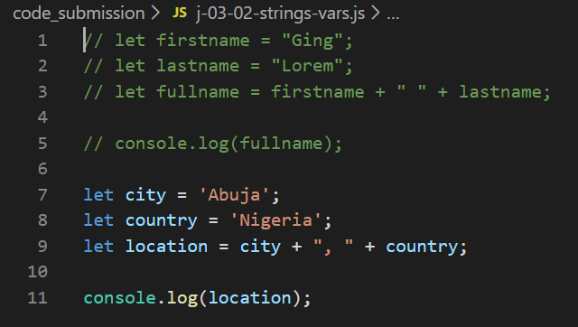
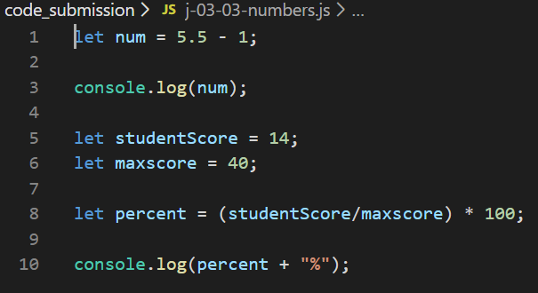
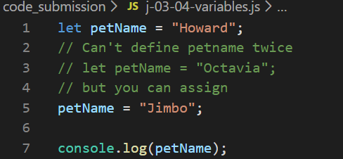
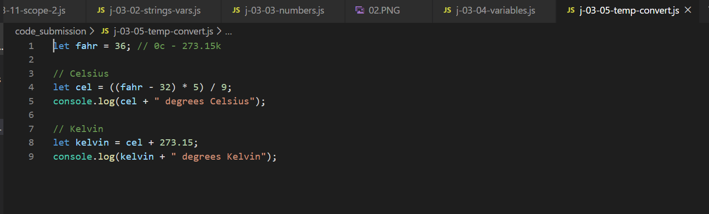
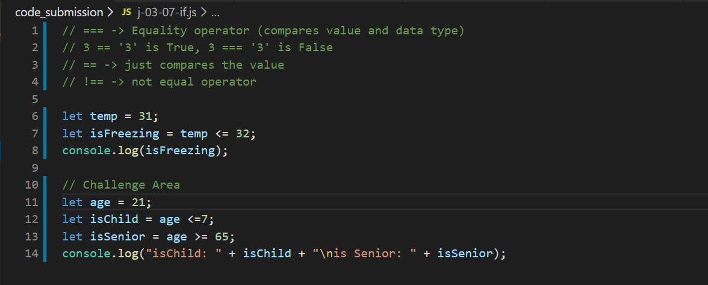
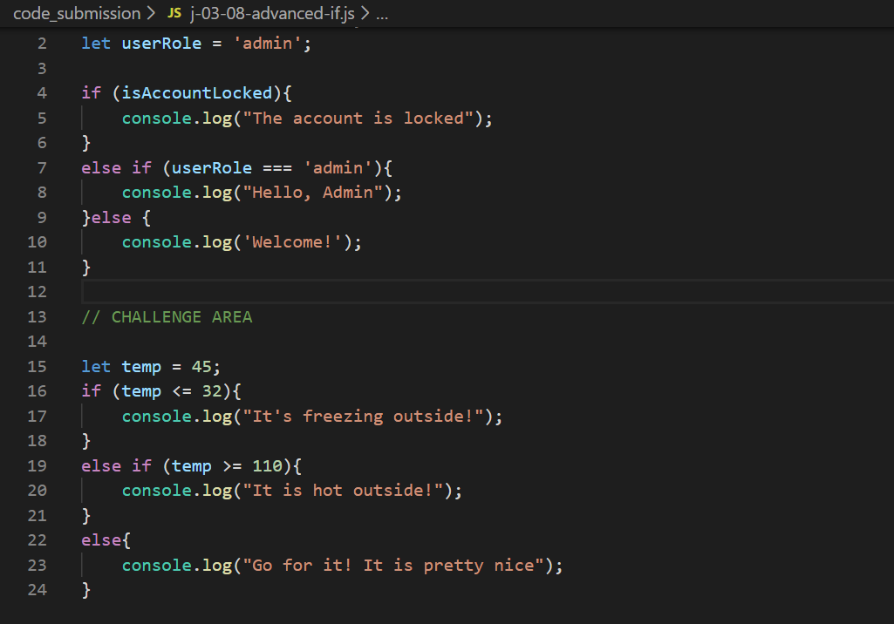
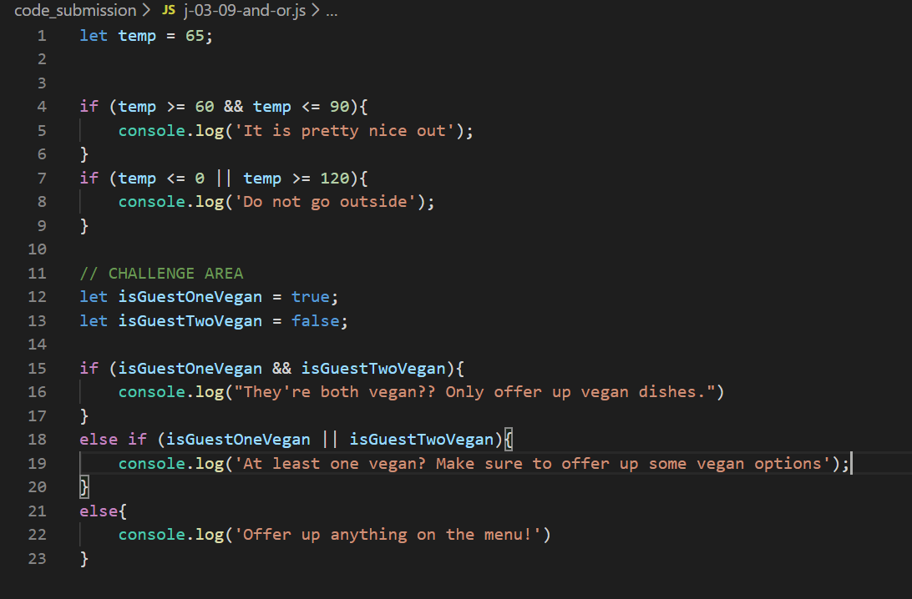
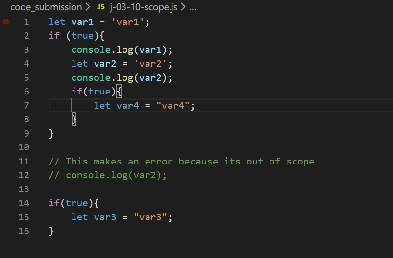
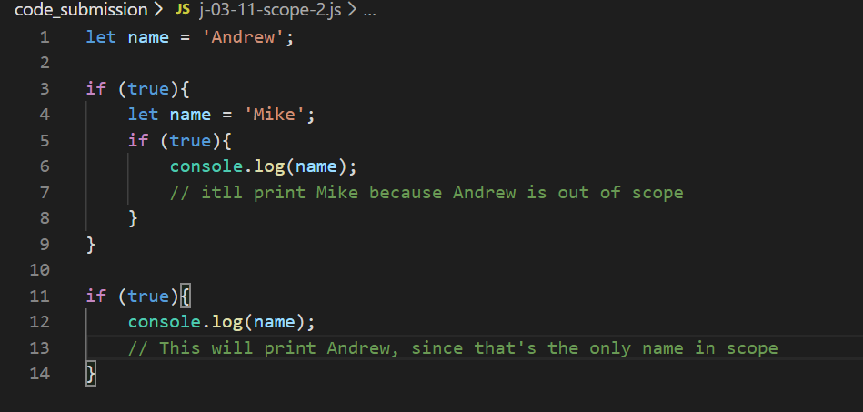
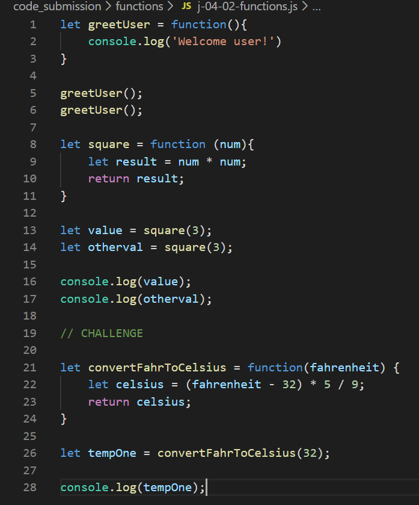

# Day-2: JS-Basics-Variables-and-Flow-Control, JS-Functions

## Purpose
The goal was to drill us on the fundamentals of JavaScript, from basic let variables to methods.

## Languages Used
1. JavaScript (duh...)

## Screenshots

